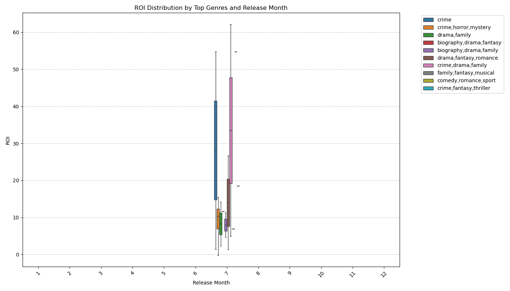
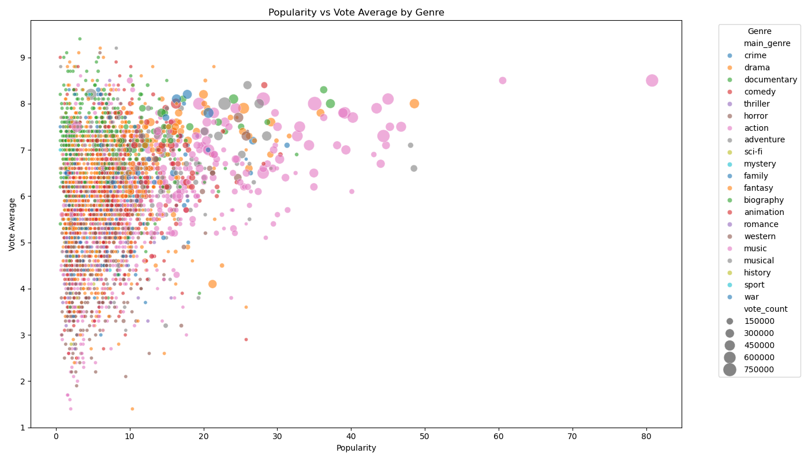

# Movie Performance & ROI Analysis

## Overview

This project analyzes movies from multiple datasets to identify patterns in **ratings**, **financial performance**, and **audience reception**. The goal is to generate **actionable recommendations** for film production teams on **what to produce**, **when to release**, and **how to maximize returns**.

---

## Business Understanding

We worked with a production team seeking to answer key business questions that drive investment and strategy decisions:

### Stakeholders:
- Film Producers
- Marketing Executives
- Distribution Strategists

### Business Questions:
1. **What genres deliver consistently high ratings and ROI?**
2. **When is the best time of year to release a film for financial success?**
3. **How well does popularity reflect quality or profitability?**
4. Are there lesser-known but high-return film types being overlooked?

---

## Data Understanding & Analysis

### Data Sources

| Dataset                     | Description                                 |
|----------------------------|---------------------------------------------|
| `movie_basics` (IMDb)      | Genre, release year, title                  |
| `movie_ratings` (IMDb)     | Ratings and vote counts                     |
| `tmdb.movies` (TMDb)       | Popularity scores, vote metrics             |
| `tn.movie_budgets` (The Numbers) | Budget, revenue, release dates       |

Merged into one comprehensive dataset with **21 columns** and over **46,000 records**.

###  Data Cleaning Steps:
- Standardized column names for consistent merging
- Converted date columns to `datetime` format
- Calculated **ROI**: `(worldwide_gross - production_budget) / production_budget`
- Created `log_vote_count` for better skew handling
- Filtered movies with valid vote counts, budgets, and years (2015–2025)
- Removed duplicate records

---

## Visualizations

All visualizations were created in **Python (Seaborn + Matplotlib)** and **Tableau** for clarity and presentation versatility.

### 1. ROI vs Production Budget by Genre
- **Insight**:- Low-budget films in genres like Horror and Thriller often yield very high returns.
- Useful for Budget allocation strategies.

**Python Example**  

---

### 2. ROI by Release Month and Genre
- **Insight**:- Movies released in **July**, **October**, and **December** show the highest ROI spikes.
- Useful for Release date planning.

**Python Example**  

---

### 3. Popularity vs Ratings by Genre
- **Insight**:- Highly popular films do not always have the highest ratings.
- Useful for Balancing critical and commercial appeal.

**Python Example**  

---

## Summary of Recommendations

1. **Invest in high-ROI genres** like Horror and Documentary — small budgets can yield large returns.
2. **Time your movie releases** for **Q3 & Q4 (July, October, December)** — these months show strong revenue returns.
3. **Don’t equate popularity with quality** — viewer satisfaction (ratings) and profitability aren’t always aligned.
4. Focus on mid-range popularity movies with high ROI potential — hidden gems that outperform expectations.

---

## Conclusion

The data shows that **budget and release timing are just as critical as content**. By combining viewer ratings, vote counts, popularity, and ROI — we derived actionable strategies to guide production and release decisions.

---

## Next Steps

1. **Further investigate distributor-specific trends** if data becomes available.
2. **Explore actor/director influence** using the `principals` and `persons` tables from IMDb.
3. **Incorporate review sentiment analysis** to refine quality scoring.
4. **Develop a predictive model** to estimate ROI based on movie attributes.

---

>  This project is accompanied by:
> - `notebook.ipynb` (full analysis with Python code)
> - `Tableau Public dashboard` (interactive visuals)
> - `movies_metadata_cleaned.csv` (final dataset)
